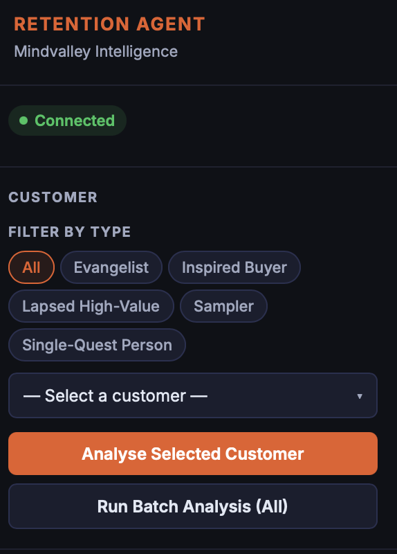
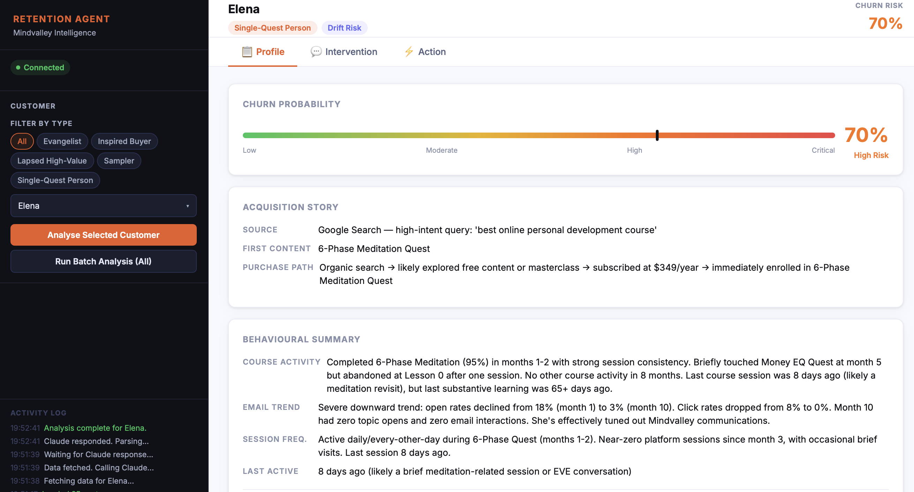
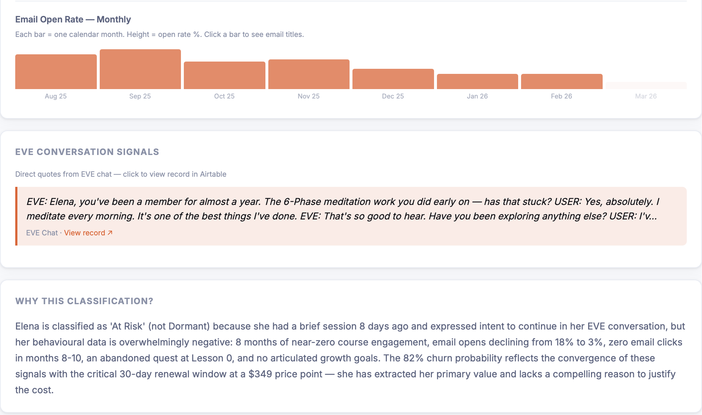
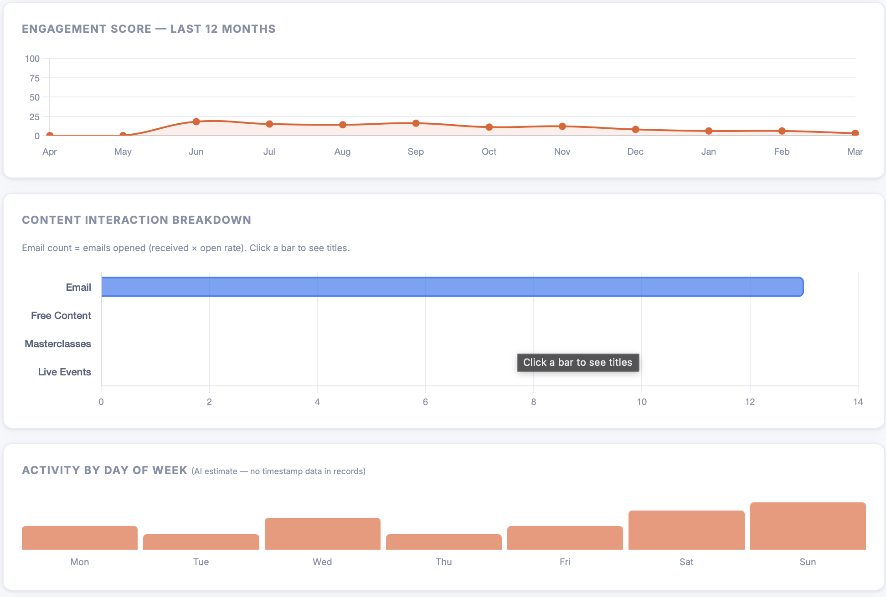
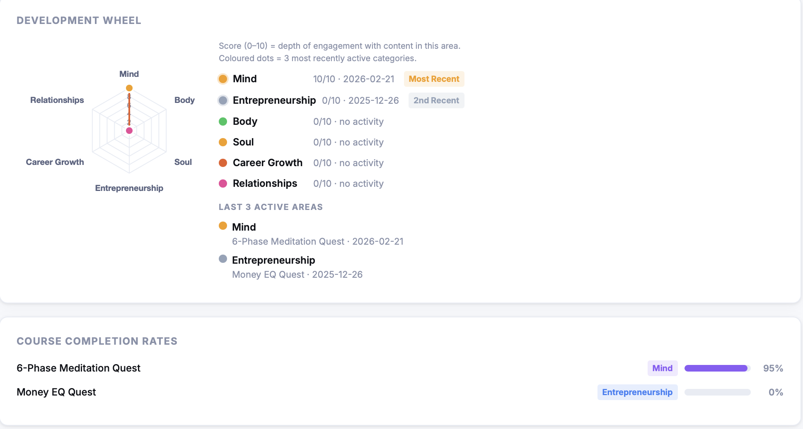
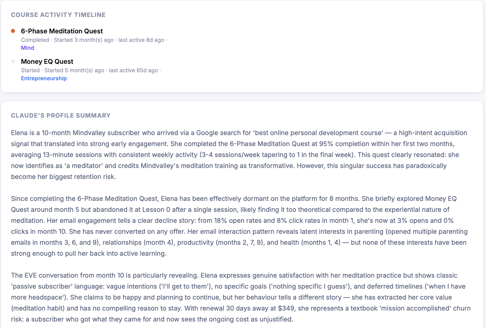
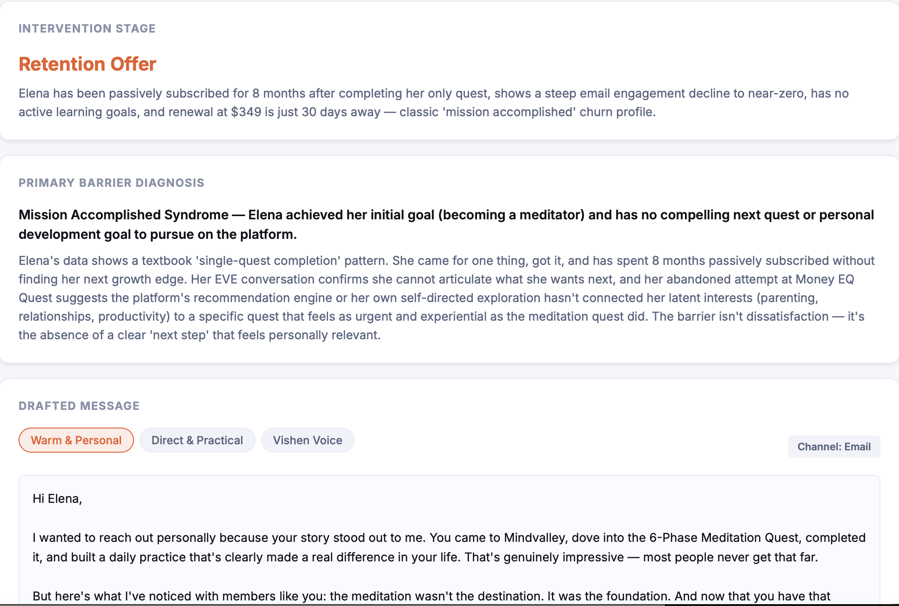
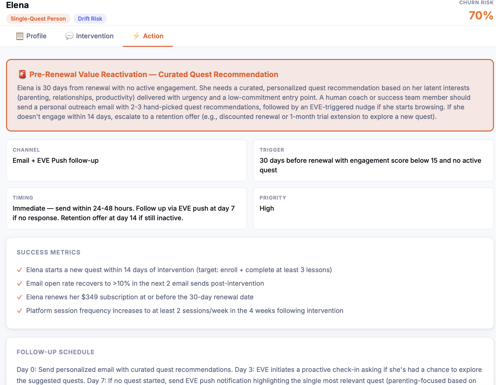

# Retention Intelligence Agent

A single-file, browser-based AI tool that analyses subscriber engagement data and generates personalised retention interventions. Built on [Airtable](https://airtable.com) + [Claude AI](https://anthropic.com). No backend, no build step — open the HTML file and go.

> **Note:** The data shown in screenshots is fully simulated.

---

## What it does

For each subscriber, the agent:

1. **Pulls data** from four Airtable tables — customer profile, course behaviour, email engagement, and AI conversation history
2. **Analyses** the subscriber via Claude — diagnosing their engagement stage, primary churn barrier, and latent interests
3. **Renders** a full behavioural profile with charts, signals, and reasoning
4. **Drafts** a personalised re-engagement message in three tone styles
5. **Recommends** a concrete retention action with channel, trigger, timing, and success metrics
6. **Saves** outputs back to Airtable for team review

---

## Screenshots

### Sidebar — subscriber selector with archetype filters

---

### Profile tab — churn risk, acquisition story, behavioural summary

---

### Email engagement + EVE conversation signals

---

### Engagement score over time + content interaction breakdown

---

### Development wheel + course completion rates

---

### Course activity timeline + AI profile summary

---

### Intervention tab — barrier diagnosis + drafted message
Three tone options — **Warm & Personal**, **Direct & Practical**, **Vishen Voice** — each generated on demand.

---

### Action tab — recommended action plan
Specific channel, trigger condition, timing, priority, success metrics, and follow-up schedule.

---

## Setup

### You need: a Claude API key
The Airtable database connection is pre-configured. The only thing you need to provide is your own **Anthropic API key**:

1. Get a free key at [console.anthropic.com](https://console.anthropic.com)
2. Download `retention_agent.html`
3. Open it in any modern browser
4. Paste your API key into the prompt on first launch

Your key is saved to browser `localStorage` — you only enter it once. To change it later, use the **⚙ Change API key** link in the sidebar.

---

## Airtable schema

| Table | Key fields |
|---|---|
| `Customers` | `customer_id`, `name`, `archetype`, `engagement_stage`, `churn_probability`, `months_as_member` |
| `Course_Behavior` | `customer_id`, `course_name`, `course_topic`, `completion_percentage`, `sessions_week_1–4`, `days_since_last_session` |
| `Email_Engagement` | `customer_id`, `month_number`, `emails_received`, `open_rate_percent`, `click_rate_percent`, `email_titles_interacted` |
| `simulation` | `customer_id`, `conversation_transcript` |
| `Agent_Outputs` | Created automatically on first save |

---

## Stack

- **Frontend:** Vanilla HTML/CSS/JS — no framework, no build step
- **AI:** Claude claude-opus-4-6 via Anthropic API (direct browser access)
- **Data:** Airtable REST API
- **Charts:** Chart.js 4.4
